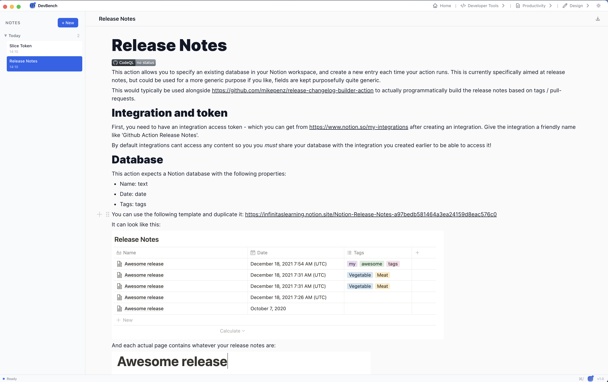
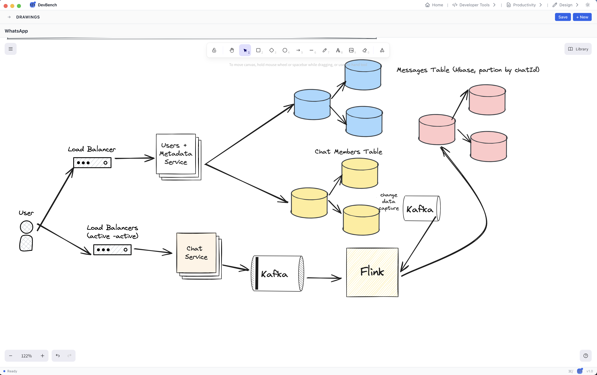
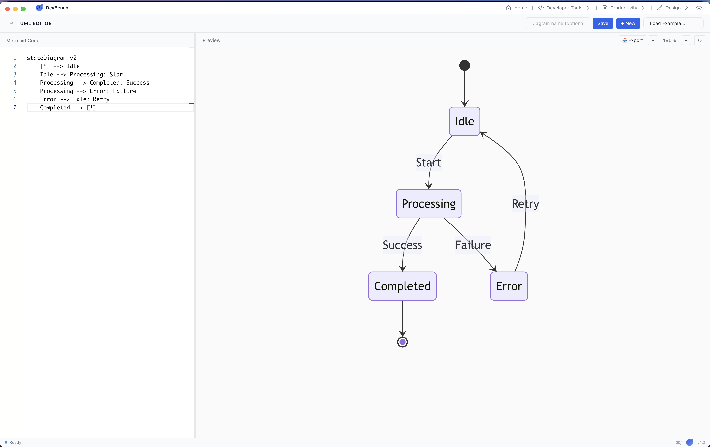
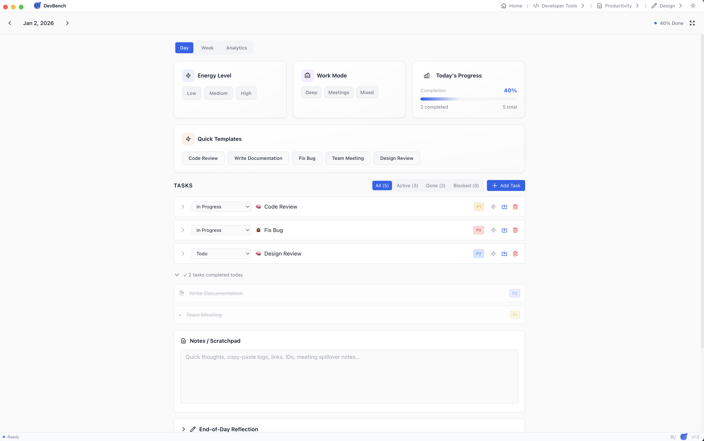
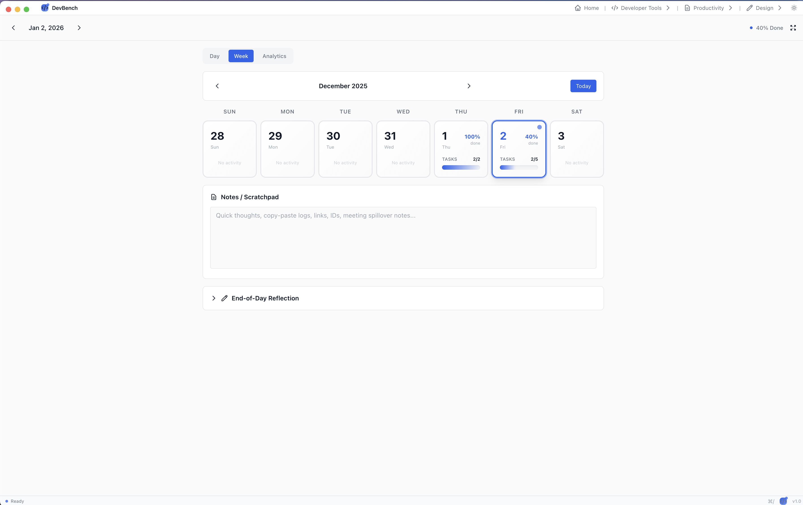
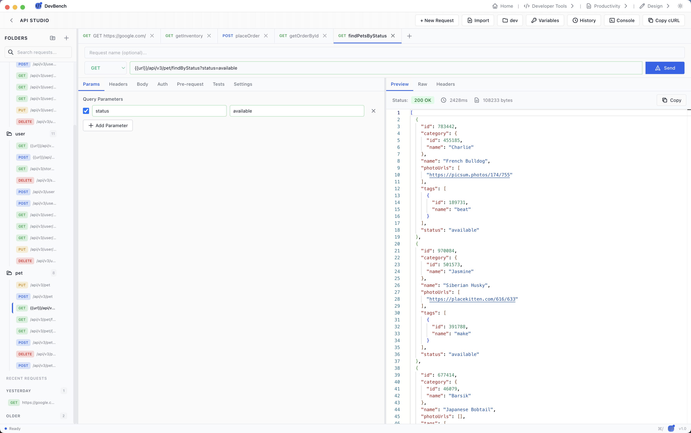
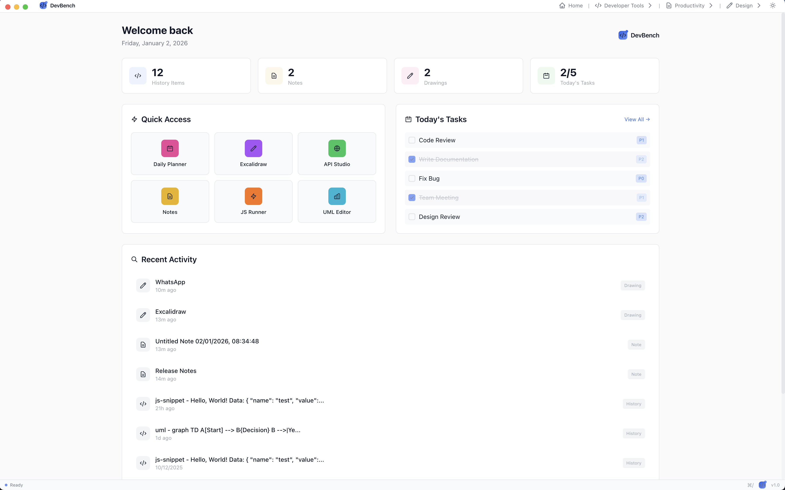

# DevBench

[](https://opensource.org/licenses/MIT)
[](LICENSE)

A comprehensive desktop application for developers that combines productivity tools, API testing, code execution, and planning features in one unified interface.

**Homepage**: [devbench.in](https://devbench.in)

**Open Source**: This project is fully open source and available under the MIT License.

## 📸 Screenshots















## 🚀 Features

### 🏠 Home Dashboard
- Quick access to all tools and features
- Today's tasks overview
- Quick navigation to frequently used tools
- Calendar integration for date selection

### 🌐 API Studio
A powerful Postman-like interface for testing REST APIs with the following features:

- **Request Management**
  - Create, save, and organize API requests in folders
  - Support for all HTTP methods (GET, POST, PUT, DELETE, PATCH, etc.)
  - Custom headers and request body
  - URL parameters support
  - Request history and recent requests

- **Response Handling**
  - Preview, Raw, and Headers view modes
  - JSON pretty-printing
  - HTML rendering in preview mode
  - Response status codes with color-coded badges
  - Copy response functionality
  - Detailed error messages with specific error codes

- **Import/Export**
  - Import cURL commands
  - Import Swagger/Postman collections
  - Individual request file storage for Git sync

- **Search & Organization**
  - Real-time search across requests and responses
  - Folder-based organization
  - Drag and drop support

### 📅 Daily Planner
A comprehensive daily planning and task management tool:

- **Task Management**
  - Create, edit, and delete tasks
  - Task status tracking (Todo, In Progress, Done, Blocked)
  - Priority levels
  - Estimated time tracking
  - Task categories and tags
  - Move tasks to next day
  - Carry forward incomplete tasks

- **Time Blocking**
  - Schedule tasks in time blocks
  - Visual calendar view
  - Drag and drop task scheduling

- **Work Modes**
  - Deep Work
  - Meetings
  - Collaboration
  - Learning
  - Review

- **Analytics & Insights**
  - Task completion statistics
  - Weekly view with task distribution
  - Productivity metrics
  - Habit tracking with streaks
  - Daily reflections

- **Habit Tracking**
  - Create and track daily habits
  - Streak calculation
  - Completion statistics
  - Separate habit storage

- **Week View**
  - Overview of the entire week
  - Task distribution across days
  - Quick navigation between dates

### 💻 JavaScript Runner
- Execute JavaScript code in a sandboxed environment
- Real-time code execution
- Output display
- Support for modern JavaScript features

### 📝 Notes
A rich text editor for taking and organizing notes:

- **Rich Text Editing**
  - BlockNote-based editor with full formatting support
  - Headings, lists, code blocks, quotes
  - Bold, italic, underline
  - Links and images

- **Note Management**
  - Create unlimited notes
  - UUID-based file naming
  - Auto-save functionality
  - Real-time sync with Git
  - Search and filter notes
  - Date-grouped organization

- **Git Integration**
  - Automatic Git sync
  - Pull before push to prevent conflicts
  - Individual file storage
  - Conflict-free editing

### 🎨 Drawing (Excalidraw)
- Create beautiful diagrams and sketches
- Excalidraw integration
- Export diagrams
- Auto-save functionality
- Git sync support

### 📊 UML Editor
Create UML diagrams using Mermaid syntax:

- **Diagram Types**
  - Sequence diagrams
  - Flowcharts
  - Class diagrams
  - State diagrams
  - And more Mermaid diagram types

- **Features**
  - Monaco Editor with syntax highlighting
  - Live preview
  - Export to PNG
  - Theme matching with DevBench
  - Code editor with auto-completion

### ☸️ Kube Lens
Browse and operate Kubernetes workloads from the desktop:

- Multi-cluster pod browser
- Pod logs, env vars, and resource details
- In-panel shell sessions and DevShell integration
- Pod restart and lifecycle actions where supported

### 🐳 Docker
Manage local containers without leaving DevBench:

- Container and image lists
- Logs and inspect views
- Open shells in DevShell

### 🖥️ DevShell
Integrated terminal tabs for day-to-day work:

- Local shell sessions with PTY support
- Kubernetes and Docker remote shells
- Multiple tabs, themes, and xterm-based rendering

### 🔧 Data utilities
Format, transform, and inspect payloads:

- JSON / XML formatter and minifier
- JSON Diff with side-by-side compare
- Schema Generator, Encoder (Base64 / URL), CSV / YAML conversion
- Regex Tester

## 📦 Installation

### macOS
1. Download the latest `DevBench-*-arm64.dmg` (Apple Silicon) or `DevBench-*-x64.dmg` (Intel) from [GitHub Releases](https://github.com/karthik-minnikanti/devbench-kit/releases)
2. Open the DMG file (it mounts as a disk image — that is normal)
3. Drag **DevBench** to your **Applications** folder, then eject the disk
4. **First launch** (unsigned developer app):
   - **Right-click** DevBench in Applications → **Open** → **Open** again in the dialog  
   - If macOS says the app is **"damaged" or "corrupted"**, that is a Gatekeeper quarantine message, not a bad download. Fix it with:
     ```bash
     xattr -cr /Applications/DevBench.app
     ```
     Then right-click → Open once more.
5. Launch DevBench from Applications

### Windows
1. Download `DevBench Setup 1.0.0.exe` for installation
   - Or `DevBench 1.0.0.exe` for portable version
2. Run the installer
3. Follow the installation wizard
4. Launch DevBench from Start Menu or desktop shortcut

### Linux
Choose the appropriate package for your distribution:

**AppImage** (Universal)
- Download `DevBench-1.0.0.AppImage` (x64) or `DevBench-1.0.0-arm64.AppImage` (ARM64)
- Make it executable: `chmod +x DevBench-1.0.0.AppImage`
- Run: `./DevBench-1.0.0.AppImage`

**Debian/Ubuntu (.deb)**
- Download `devbench-desktop_1.0.0_amd64.deb` (x64) or `devbench-desktop_1.0.0_arm64.deb` (ARM64)
- Install: `sudo dpkg -i devbench-desktop_1.0.0_amd64.deb`
- Fix dependencies if needed: `sudo apt-get install -f`

## 🔧 Setup

### Environment variables
Copy `.env.example` to `.env.local` for local development:

```bash
cp .env.example .env.local
```

Production release builds use `https://dev-api.devbench.in` automatically.

### Git Integration
DevBench uses Git for data synchronization and version control:

1. On first launch, you'll be prompted to set up a Git repository
2. Choose an existing repository or create a new one
3. All your data (notes, drawings, API requests, planner entries) will be stored in the repository
4. Changes are automatically synced with Git

### Data Storage
All data is stored locally in your Git repository:
- Notes: `notes/` directory
- Drawings: `drawings/` directory
- API Requests: `apiclient/` directory (individual JSON files)
- Planner Entries: `planner/` directory (date-based JSON files)
- Habits: `habits/` directory (separate from planner)

## ⌨️ Keyboard Shortcuts

- `Cmd/Ctrl + K` - Open global search
- `Cmd/Ctrl + /` - Show keyboard shortcuts
- `Cmd/Ctrl + Enter` - Send API request (in API Studio)

## 🛠️ Technology Stack

- **Framework**: Electron 32.0.0
- **Frontend**: React 18.2.0 with TypeScript
- **Build Tool**: Vite 5.0.8
- **Editor**: BlockNote (Notes), Monaco Editor (UML Editor)
- **Diagramming**: Excalidraw, Mermaid.js
- **Styling**: Tailwind CSS

## 📄 License

This project is open source and available under the [MIT License](LICENSE).

Copyright (c) 2025 Karthik Minnikanti

## 🤝 Contributing

Contributions are welcome! Please feel free to submit a Pull Request.

## 🏢 Enterprise

DevBench Enterprise is available for teams and organizations. Contact us for licensing, rollout support, and subscription management.

- **Email**: [contact@devbench.in](mailto:contact@devbench.in)
- **Website**: [devbench.in](https://devbench.in)

## 📧 Contact

- **Author**: Karthik Minnikanti
- **Email**: [contact@devbench.in](mailto:contact@devbench.in)
- **Homepage**: [devbench.in](https://devbench.in)
- **Repository**: [github.com/karthik-minnikanti/devbench-kit](https://github.com/karthik-minnikanti/devbench-kit)

## 🔄 Version History

### Version 0.1.8
- Marketing website at devbench.in with enterprise contact
- Hide Profile section from navigation (temporary)
- Unified contact email: contact@devbench.in

### Version 0.1.7
- Kube Lens pod shells via DevShell with improved PTY handling
- Embedded terminal in K8s pod panel
- Remote shell bootstrap fixes for kubectl exec

### Version 0.1.1
- Initial release
- API Studio
- Daily Planner with task management and habit tracking
- JavaScript Runner
- Rich text Notes with Git sync
- Excalidraw integration
- UML Editor with Mermaid support
- Cross-platform support (macOS, Windows, Linux)

---

**Note**: This application requires Git to be installed on your system for data synchronization. Make sure Git is properly configured before using DevBench.

